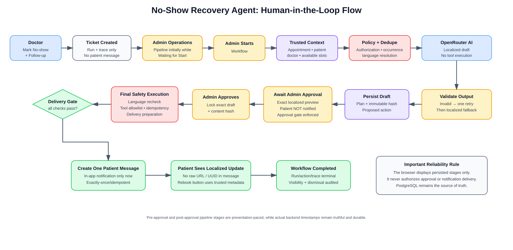

# Agentic Care Journey Agents

This document explains what the AI agents in this telemedicine platform do, why they are needed, how they are controlled, and how the two current workflows operate.

The short version: these agents are **not autonomous doctors and not chatbots with database access**. They are controlled workflow engines that use AI only for bounded planning and patient-friendly wording, while the application owns authorization, clinical rules, state transitions, retries, tool execution, approval, and delivery.

## Diagrams

Rendered diagrams are available directly in GitHub:

- [AI agent architecture](diagrams/ai-agent-architecture.svg)
- [No-show recovery workflow](diagrams/no-show-agent-flow.svg)

Editable Draw.io source:

- [`docs/diagrams/AI_AGENT_WORKFLOWS.drawio`](diagrams/AI_AGENT_WORKFLOWS.drawio)

The Draw.io file contains three pages:

1. Agent Architecture
2. No-Show Recovery
3. Post-Visit Follow-Up

## Why Is an AI Agent Needed?

A normal telemedicine application records appointments, prescriptions, documents, and messages. The difficult part is what happens **between** those records.

Examples:

- A patient misses a consultation. Someone must notice it, check whether recovery is appropriate, identify available slots, prepare a respectful message in the patient's language, obtain approval, and create a safe rebooking path.
- A consultation is completed. Someone must convert the doctor-authored prescription into a patient-friendly explanation without changing medication instructions, then create the appropriate follow-up/reminder actions.
- Staff should not have to manually repeat the same coordination work for every appointment.
- AI provider failures must not make the care-coordination workflow disappear.
- Patient-facing automation must remain auditable and under human control.

The agents solve this coordination problem.

They combine:

- trusted database context
- deterministic policy checks
- AI-assisted drafting
- deterministic fallback
- human approval
- fixed server-side tools
- durable workflow state
- idempotency and retry protection
- observability through the admin operations console

This gives the application useful automation without giving the language model unrestricted control.

## What Makes This an Agent Instead of a Chatbot?

A chatbot mainly accepts text and returns text.

These agents perform a multi-step goal-oriented workflow:

1. Observe a clinical workflow event.
2. Load trusted context from the database.
3. Check policy and authorization.
4. Decide whether the workflow is eligible.
5. Ask the AI provider for a constrained structured draft.
6. Validate the draft.
7. Fall back deterministically if the provider fails or produces unsafe/invalid output.
8. Persist a plan and proposed actions.
9. Stop for human approval.
10. Execute only pre-defined backend tools.
11. Verify the final delivery gate.
12. Persist the patient-facing result exactly once.
13. Record trace and execution events for operations/audit visibility.

The model is therefore one component inside a larger controlled agent system. It is not the authority for clinical state or side effects.

## Current Agents

The repository currently contains two care-journey agents:

### 1. No-Show Recovery Agent

Purpose: recover a missed consultation safely and help the patient rebook.

The agent can:

- create a recovery ticket after a doctor marks an appointment as no-show
- load appointment, patient, doctor, no-show, and future-slot context
- resolve the patient's saved language
- draft a localized recovery message
- use a deterministic localized fallback if AI output is invalid or unavailable
- propose the fixed `queue_no_show_recovery_message` action
- wait for administrator approval
- run final safety, language, allow-list, and idempotency checks
- queue exactly one approved in-app patient notification
- expose a trusted rebooking action without placing raw internal URLs or UUIDs in the patient-visible message

The agent does **not**:

- diagnose the patient
- recommend treatment
- invent appointment availability
- book a slot without the patient choosing it
- bypass administrator approval
- expose internal route parameters in the notification body
- directly send WhatsApp/SMS while claiming external delivery

### 2. Post-Consultation Follow-Up Agent

Purpose: turn an existing doctor-authored prescription into an easier patient follow-up while preserving the clinical instructions exactly.

The agent can:

- load the completed consultation and prescription
- ask AI for a patient-friendly explanation
- verify medication name, dosage, frequency, and duration against the original prescription
- fall back to deterministic prescription-based wording if AI output is invalid
- propose `queue_post_visit_summary`
- propose `schedule_refill_reminder`
- execute only approved actions through fixed backend tools

The agent does **not**:

- add a medicine
- remove a medicine
- change dosage
- change frequency
- change duration
- invent a diagnosis
- change the doctor's follow-up timing

## Architecture


The architecture intentionally separates intelligence from authority.

### AI provider

The planner currently uses the configured OpenRouter path, with the production model set to `openai/gpt-oss-120b`.

AI is used for:

- structured planning
- patient-friendly phrasing
- multilingual wording
- concise rationale/safety notes for human review

AI is **not** used to authorize requests, choose arbitrary tools, mutate clinical records directly, or decide whether approval can be skipped.

### Orchestrator

`agent-orchestrator.service.js` coordinates the lifecycle:

- ticket/run creation
- context loading
- policy validation
- deduplication
- planning
- draft persistence
- action creation
- state transitions
- failure handling

### Policy and validation

Policy services enforce deterministic rules around:

- allowed actors
- eligible appointment state
- no-show occurrence semantics
- medication fidelity
- patient-language validity
- safe patient-facing content
- server-defined tool allow-list

### Fixed tools

The model never invents a function name and gets it executed.

The backend exposes only known tool implementations such as:

```text
queue_no_show_recovery_message
queue_post_visit_summary
schedule_refill_reminder
```

Action arguments are persisted and later checked by the backend before execution.

### Database as source of truth

PostgreSQL stores the canonical workflow state.

Important persisted records include:

- `AgentRun`
- `AgentAction`
- `AgentMessageDraft`
- `AgentExecutionTrace`
- `AgentExecutionEvent`
- `AgentExecutionStep`
- final in-app consultation messages

Supabase Realtime and polling transport changes to the UI, but they do not become the workflow authority.

## No-Show Recovery Workflow



The live workflow is deliberately split into **two human gates**.

### Phase 1: Doctor creates a recovery ticket

The assigned doctor uses the appointment action:

```text
Mark No-show + Follow-up
```

At this point the system creates or reuses a no-show recovery ticket/run and trace.

The AI workflow has not yet started.

The patient has not been notified.

Repeated requests for the same no-show occurrence reuse the existing run instead of creating another planning call/action/message.

### Phase 2: Administrator starts planning

In the admin AI Agent Operations view, a new no-show ticket initially waits for administrator start.

Administrator route family:

```text
POST /api/admin/agents/runs/:runId/start
POST /api/v1/admin/agents/runs/:runId/start
```

Only an administrator can use the admin agent routes.

After Start, the workflow performs the planning stages:

```text
Triggered
Context loaded
Policy validated
Deduplication checked
AI model called
Output validated
Plan saved
Awaiting approval
```

The dashboard presentation deliberately makes persisted stages visible sequentially. The presentation timeline must never be confused with authorization: the browser can display a countdown, but it cannot tell the backend that approval/delivery is allowed.

### Phase 3: AI planning and fallback

The backend loads trusted context, including:

- appointment
- patient
- doctor
- no-show occurrence
- available future slots
- patient language
- safe internal rebooking metadata

The model is asked for structured output containing administrator-facing information and patient-facing localized text.

Patient-facing output is validated before it can become an approval-ready draft.

Validation includes checks for:

- required localized title/body
- target script/language
- slot fidelity
- unsafe booking claims
- medical advice patterns
- raw URLs
- route parameters
- UUID/internal references

If model output fails validation, the system performs the controlled corrective path. If valid output still cannot be obtained, a deterministic localized template is used.

A fallback is therefore a **safe degraded success**, not automatically a workflow failure.

### Phase 4: Administrator reviews exact draft

The workflow stops at the approval gate.

The admin sees the exact persisted patient-facing draft plus operational metadata such as:

- language
- provider/model
- whether fallback was used
- proposed action
- risk information
- draft/content hash

The patient still has no notification.

The admin can approve and continue, or reject.

### Phase 5: Final approved execution

After approval, the system locks the approved content and runs final execution checks such as:

- approval verification
- draft/content-hash verification
- patient-language revalidation
- localized-message verification
- tool allow-list verification
- safety validation
- delivery preparation
- idempotency/concurrency protection
- final delivery gate

Only after these checks and the final workflow gate may the application create the patient message.

### Phase 6: Patient result

The final notification is stored as an in-app patient message.

The notification UI uses patient-language metadata and keeps technical navigation separate from visible prose.

A rebooking path may exist in trusted message metadata, but the patient-facing text must not display raw values such as:

```text
/book?doctorId=...
fromAppointmentId=...
runId=...
traceId=...
<UUID>
```

The patient instead receives a normal localized CTA such as “Rebook appointment.”

Visibility and dismissal events remain auditable. Dismissing a notification does not delete the original message record.

## Post-Consultation Follow-Up Workflow

The post-visit agent begins from a completed consultation with a doctor-authored prescription.

High-level flow:

```text
Completed consultation
        ↓
Load prescription context
        ↓
AI creates patient-friendly draft
        ↓
Medication fidelity validation
        ↓
Valid? ── no ──> deterministic prescription-based fallback
        ↓ yes
Persist plan + proposed actions
        ↓
Human review / approval
        ↓
Fixed server tools
        ↓
Approved follow-up + reminder behavior
```

The key rule is that AI may explain the prescription, but the prescription remains the authority.

## Human-in-the-Loop Safety

Human approval exists because these workflows create patient-facing side effects.

For the no-show operations workflow, administrator-only routes are protected by authentication and `roleRequired('admin')`.

The human is reviewing a persisted draft, not an untracked live model response.

This provides:

- accountability
- predictable behavior
- auditability
- protection from model hallucination
- protection from accidental external side effects

## Idempotency and Duplicate Protection

Agent workflows are designed so network retries and double-clicks do not become duplicate patient messages.

Protection exists at multiple levels:

- run-level dedupe key
- no-show occurrence/version semantics
- action-level idempotency key
- atomic execution claims
- message-level uniqueness/idempotency
- disjoint execution-step sequence namespaces
- database constraints/triggers as defense in depth

The presentation pipeline uses macro sequence values `1-11`. Detailed execution steps use a separate `101+` namespace so they cannot collide with presentation rows.

## Recovery and Retry

A failure should be visible and recoverable without repeating a patient side effect.

The admin operations layer includes a safe retry path for eligible no-show execution failures.

Retry logic must first confirm that recovery is safe. It must not blindly recreate actions or patient messages.

The application also contains state reconciliation/integrity support for workflow relationships and stale-state detection.

## Observability

The admin AI Agent Operations Center is an operational view of persisted backend truth.

It exposes items such as:

- trace/run state
- active pipeline stage
- provider/model/fallback information
- proposed/approved/executing actions
- event history
- execution steps
- delivery result
- integrity information

Realtime improves responsiveness, while polling provides a fallback. Neither one changes the underlying workflow state by itself.

## Why the Presentation Pipeline Has Visible Stage Timing

The operations UI deliberately makes stages visible long enough for humans to understand what is happening during demonstrations and review.

Two separate concepts are kept:

- **actual backend timing**: when work really happened
- **presentation timing**: how long a persisted workflow stage remains visible in the operations UI

Presentation timing must never falsify actual event timestamps and must never become the authorization mechanism for tool execution or patient delivery.

## Security Boundary

The browser never receives:

- OpenRouter API key
- Supabase service-role key
- database URL
- internal worker secret
- unrestricted tool executor

The AI model cannot:

- grant itself permissions
- approve its own action
- select an arbitrary backend function
- bypass the delivery gate
- directly update the database
- create an external delivery channel by itself

## Main Implementation Files

### Backend

- `apps/backend/services/agent-context.service.js`
- `apps/backend/services/agent-planner.service.js`
- `apps/backend/services/agent-policy.service.js`
- `apps/backend/services/agent-language-validation.service.js`
- `apps/backend/services/patient-language.service.js`
- `apps/backend/services/agent-actions.service.js`
- `apps/backend/services/agent-orchestrator.service.js`
- `apps/backend/services/agent-presentation.service.js`
- `apps/backend/services/agent-state-machine.service.js`
- `apps/backend/services/agent-state-reconciliation.service.js`
- `apps/backend/services/agent-execution-retry.service.js`
- `apps/backend/services/agent-observability.service.js`
- `apps/backend/services/patient-notifications.service.js`
- `apps/backend/controllers/agents.controller.js`
- `apps/backend/controllers/admin-agents.controller.js`
- `apps/backend/routes/agents.routes.js`
- `apps/backend/routes/admin-agents.routes.js`

### Frontend

- `apps/frontend/src/pages/AdminAgentOperationsPage.jsx`
- `apps/frontend/src/components/AgentPlanPanel.jsx`
- `apps/frontend/src/components/PatientNotificationBanner.jsx`
- `apps/frontend/src/components/patientNotificationLabels.js`

### Database

- `prisma/schema.prisma`
- `prisma/migrations/20260729000000_add_agent_workflows/`
- `prisma/migrations/20260802000100_agent_execution_observability/`
- `prisma/migrations/20260805000100_admin_start_gated_no_show/`
- `prisma/migrations/20260805000200_enforce_agent_presentation_timing/`
- `prisma/migrations/20260807000100_harden_agent_step_namespace/`

## Draw.io: How to Edit the Diagrams

The editable source is:

```text
docs/diagrams/AI_AGENT_WORKFLOWS.drawio
```

### Option A: diagrams.net

1. Open <https://app.diagrams.net/>.
2. Choose **Device** or your preferred storage provider.
3. Select **File → Open From → Device**.
4. Open `AI_AGENT_WORKFLOWS.drawio` from the repository.
5. Use the page tabs at the bottom to switch between:
   - Agent Architecture
   - No-Show Recovery
   - Post-Visit Follow-Up
6. Edit shapes/connectors.
7. Save the `.drawio` source back into the repository.
8. Export important pages as SVG using **File → Export as → SVG**.
9. Replace the matching files under `docs/diagrams/` so GitHub documentation stays visually up to date.

### Option B: VS Code

Install a Draw.io/diagrams.net extension that supports `.drawio` files, then open:

```text
docs/diagrams/AI_AGENT_WORKFLOWS.drawio
```

The repository keeps the editable source and rendered SVGs together so future architecture changes can update both.

### Diagram conventions used here

- Blue: clinician/AI-generation steps
- Yellow: human gates or fallback/waiting states
- Purple: orchestration/state infrastructure
- Red: safety/policy validation
- Green: approved tools and patient-visible results
- Grey: persisted infrastructure/source of truth

When the agent implementation changes, update the diagrams in the same pull request as the code whenever the user journey or safety boundary changes.

## Testing

Useful verification commands:

```bash
npx prisma format
npx prisma validate
npx prisma generate
npm run lint
npm test
npm run build
npm run test:e2e
```

Focused tests cover planning, presentation, localization, state transitions, notification behavior, deduplication, execution-step sequencing, and integration behavior.

## Summary

The purpose of these AI agents is not to replace the doctor.

Their purpose is to make repetitive care coordination reliable:

```text
Clinical event
   + trusted context
   + deterministic policy
   + AI-assisted wording
   + deterministic fallback
   + human approval
   + fixed tools
   + durable execution
   = safer automated follow-up
```

That is the core design principle of the agent system in this repository.
